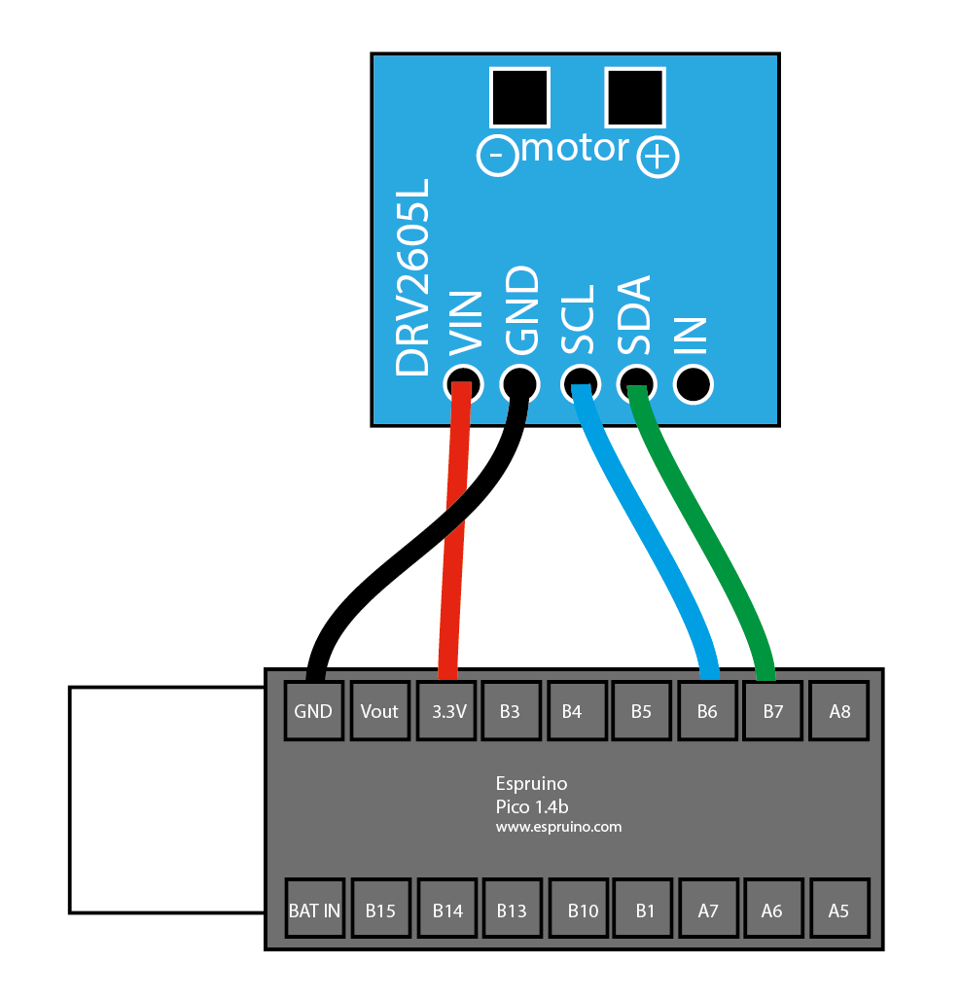

# espruino / drv2605

Controls a DRV2605 haptic driver. This demo only works in Chrome.

- [More about the DRV2605 module](http://www.espruino.com/DRV2605)
- [DRV2605 playground](https://clinth.github.io/ixfx-play/io/espruino-drv2605/index.html)
- [ixfx Espruino module](https://clinth.github.io/ixfx/modules/Io.Espruino.html)

This demo (and the [playground](https://clinth.github.io/ixfx-play/io/espruino-repl/index.html)) expect the provided [`espruino.js`](https://raw.githubusercontent.com/ClintH/ixfx-demos/main/io/espruino/drv2605/espruino.js) to be flashed on to the Pico beforehand using the Espruino IDE. In doing this, an [additional code module](http://www.espruino.com/DRV2605) is automatically pulled in. This module is a 'driver' that does the low-level communication over I2C to the DRV2605. The DRV2605 in turn is a 'driver' for the motor.

Remember that the haptic motors are not designed to run for long periods of time. They are meant for periodic bursts.

# Getting started

## One-time setup

1. Ensure your Espruino Pico is not connected to power or your computer.

2. Connect the DRV2605 haptic board according to the instructions below.

Wiring for an Espruino Pico:

- DRV2605 GND -> Pico GND
- DRV2605 VIN -> Pico 3.3V
- DRV2605 SCL -> Pico B6
- DRV2605 SDA -> Pico B7
- DRV2605 IN (unconnected)

In the picture, the Pico is upside down. Its pins are facing upwards and all the components facing downwards. Thus, the text shown on the Pico in the illustration ('Pico 1.4b' etc) should be the same as how you have oriented the board.




3. Connect a motor to the board.
4. Plug your Pico into your computer. Be mindful that with some USB adapters, you might accidently plug the Pico in upside-down. You should see a light flash red on the Pico when you plug it in.
5. If you get a warning about an old firmware version, you should update it first ([read the instructions under Web IDE](https://www.espruino.com/Firmware+Update#stm32)).
6. Try this simple sketch in the [Espruino IDE](https://www.espruino.com/ide) to verify it works. You should get a vibration when the sketch is loaded.

```js
I2C1.setup({scl: B6, sda: B7 });
var hap = require('DRV2605').connect(I2C1);
// Trigger effect #5
hap.trigger(6);

// Trigger by name
hap.trigger('sharp click 30%');
```

6. Now that you know it works, we want to flash the provided [`espruino.js`](https://raw.githubusercontent.com/ClintH/ixfx-demos/main/io/espruino/drv2605/espruino.js) sketch. Copy and paste this into the IDE. Make sure you select 'Flash', not 'RAM'. This sketch will make it easier to steer the controller from the browser. If it worked, you should see the message "Hello from the DRV2605 script!".


## Manual control

Try running some of the functions below in the Espruino IDE's REPL (the left side where you can enter text for immediate execution). These are
the same functions we'll call from the browser.

```js
// Trigger effect #1 (it goes up to 127)
trigger(1);

// Trigger an effect by name
trigger("pulsing sharp 1 100%");
```

'Real time processing' is where motor power is set in real time. In this case,
there's a helper function `rtpMode` that lets you queue motor powers and
durations. Two arrays are used for this, each array index being a 'step' in a
sequence. In the example below, in the first step the motor is set to 30 power for 100ms.

```js
// Motor power (0-200) & durations (millis)
let powers = [30, 100, 30, 127, 90, 100];
let durations = [100, 200, 100, 300, 200, 100];
rtpMode(powers, durations);
```

For the endurance of the motor, duration of each step is capped to 1000ms. Call
`rtpCancel()` to cancel a long-running sequence. Whilst the RTP sequence is
running, it's not possible to trigger other effects.

To use the DRV205's seven-step effect sequencer:

```js
// Sequence effects 12, 4, 10
setSequence([12, 4, 10]);
start(); // Initiate
```

# From the browser

It's necessary to connect to the Espruino via user interaction, in this case
clicking a button. Using
[ixfx's Espruino module](https://clinth.github.io/ixfx/modules/Io.Espruino.html),
we invoke functions declared by `espruino.js`.

For example, invoke `trigger` on the Espruino, giving it the argument `2` to play effect #2.

```js
espruino.write(`trigger(2)\n`);
```

The provided `espruino.js` file defines the functions that we call from the browser. It also does a little bit of housekeeping to make life easier. For timing-sensitive operations you may want add functions which are then invoked from the browser.

# Effects

After uploading `espruino.js`, you can list all available effects by pasting
this into the Espruino IDE's REPL:

```js
for (let i = 0; i < hap.EFFECTS.length; i++) {
  console.log((i + 1) + ". " + hap.EFFECTS[i]);
}
```

Here they are...

1. strong click 100%
2. strong click 60%
3. strong click 30%
4. sharp click 100%
5. sharp click 60%
6. sharp click 30%
7. soft bump 100%
8. soft bump 60%
9. soft bump 30%
10. double click 100%
11. double click 60%
12. triple click 100%
13. soft fuzz 60%
14. strong buzz 100%
15. 750 ms alert 100%
16. 1000ms alert 100%
17. strong click 1 100%
18. strong click 2 80%
19. strong click 3 60%
20. strong click 4 30%
21. medium click 1 100%
22. medium click 2 80%
23. medium click 3 60%
24. sharp tick 1 100%
25. sharp tick 2 80%
26. sharp tick 3 60%
27. short double click strong 1 100%
28. short double click strong 2 80%
29. short double click strong 3 60%
30. short double click strong 4 30%
31. short double click medium 1 100%
32. short double click medium 2 80%
33. short double click medium 3 60%
34. short double sharp tick 1 100%
35. short double sharp tick 2 80%
36. short double sharp tick 3 60%
37. long double sharp click strong 1 100%
38. long double sharp click strong 2 80%
39. long double sharp click strong 3 60%
40. long double sharp click strong 4 30%
41. long double sharp click medium 1 100%
42. long double sharp click medium 2 80%
43. long double sharp click medium 3 60%
44. long double sharp tick 1 100%
45. long double sharp tick 2 80%
46. long double sharp tick 3 60%
47. buzz 1 100%
48. buzz 2 80%
49. buzz 3 60%
50. buzz 4 40%
51. buzz 5 20%
52. pulsing strong 1 100%
53. pulsing strong 2 60%
54. pulsing medium 1 100%
55. pulsing medium 2 60%
56. pulsing sharp 1 100%
57. pulsing sharp 2 60%
58. transition click 1 100%
59. transition click 2 80%
60. transition click 3 60%
61. transition click 4 40%
62. transition click 5 20%
63. transition click 6 10%
64. hum 1 100%
65. hum 2 80%
66. hum 3 60%
67. hum 4 40%
68. hum 5 20%
69. hum 6 10%
70. ramp down long smooth 1
71. ramp down long smooth 2
72. ramp down medium smooth 1
73. ramp down medium smooth 2
74. ramp down short smooth 1
75. ramp down short smooth 2
76. ramp down long sharp 1
77. ramp down long sharp 2
78. ramp down medium sharp 1
79. ramp down medium sharp 2
80. ramp down short sharp 1
81. ramp down short sharp 2
82. ramp up long smooth 1
83. ramp up long smooth 2
84. ramp up medium smooth 1
85. ramp up medium smooth 2
86. ramp up short smooth 1
87. ramp up short smooth 2
88. ramp up long sharp 1
89. ramp up long sharp 2
90. ramp up medium sharp 1
91. ramp up medium sharp 2
92. ramp up short sharp 1
93. ramp up short sharp 2
94. ramp down long smooth 1 half
95. ramp down long smooth 2 half
96. ramp down medium smooth 1 half
97. ramp down medium smooth 2 half
98. ramp down short smooth 1 half
99. ramp down short smooth 2 half
100. ramp down long sharp 1 half
101. ramp down long sharp 2 half
102. ramp down medium sharp 1 half
103. ramp down medium sharp 2 half
104. ramp down short sharp 1 half
105. ramp down short sharp 2 half
106. ramp up long smooth 1 half
107. ramp up long smooth 2 half
108. ramp up medium smooth 1 half
109. ramp up medium smooth 2 half
110. ramp up short smooth 1 half
111. ramp up short smooth 2 half
112. ramp up long sharp 1 half
113. ramp up long sharp 2 half
114. ramp up medium sharp 1 half
115. ramp up medium sharp 2 half
116. ramp up short sharp 1 half
117. ramp up short sharp 2 half
118. long buzz no stop
119. smooth hum 1 50%
120. smooth hum 2 40%
121. smooth hum 3 30%
122. smooth hum 4 20%
123. smooth hum 5 10%
